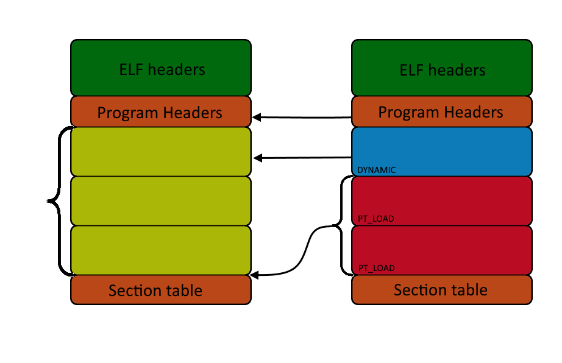
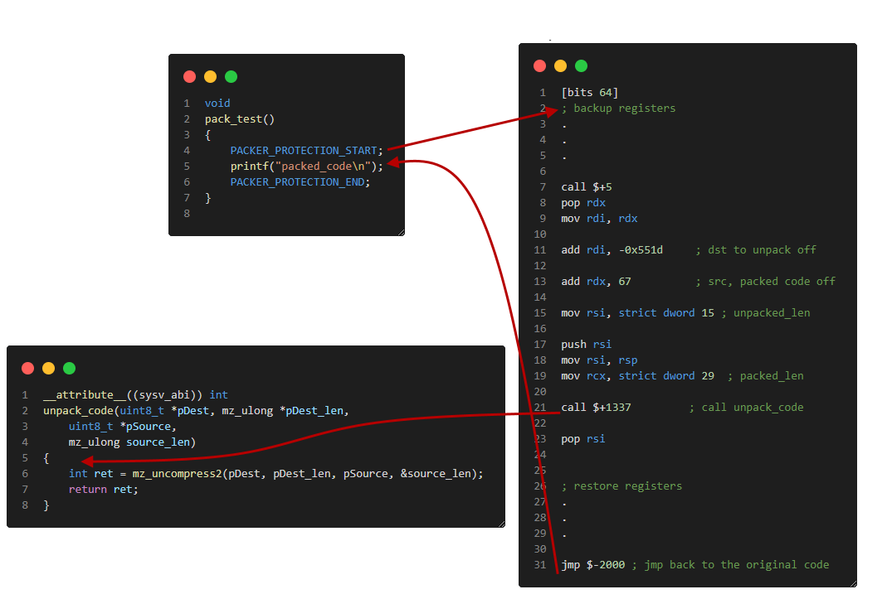
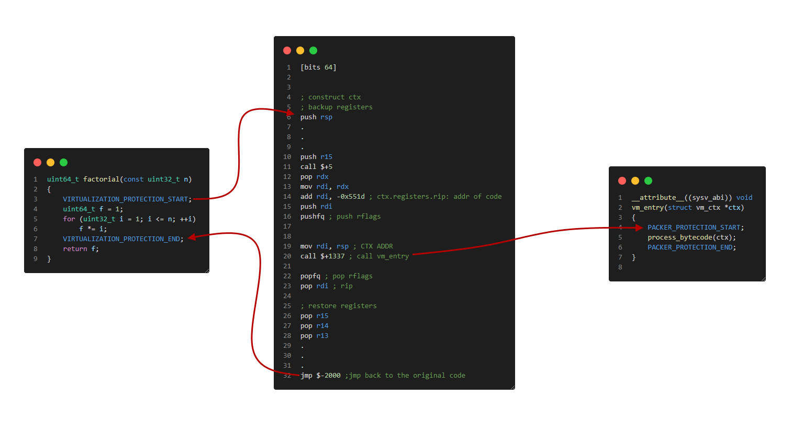

# ELFProtect

## !!!CAUTION!!!
This project is in very early/unpolished state and I'm not planning to improve it. Use only for learning purpose!


## About
This is a project I wrote for my engineering thesis some time ago.
The aim of it was to develop an application capable of protecting native linux executable files from reverse engineering by utilizing runtime code unpacking and virtualization of machine code.  


## How does the elfprotect work?
It attaches a payload to the protected program, searches for markers left by the SDK in the code section, and based on this, applies appropriate security measures to the specified code fragment. In the case of packing, the marked fragment is compressed using the Deflate algorithm and placed in an additionally created segment of the file. There is also the possibility of later encrypting this data. Then, the marked fragment and markers are overwritten with random bytes, then the application generates a dispatcher, places it in a previously added new segment and adds a jump from the location of the marker to the generated dispatcher. In the case of virtualization, the marked fragment of machine code is compiled into the bytecode of the virtual machine and saved to a previously added segment. A dispatcher is also generated, which calls the function which enters the virtual machine. The rest of the steps are analogous to the packing described above.


### Modifications to the ELF Binary
New PT_LOAD segments are added. Firsts contains code sections from payload(code of vm, and for unpacking). Second one is for dispatchers, packed machine code and bytecode generated for marked functions when virutalization is selected. Dispatcher is generated for every marked code. 

When adding new segment, a new program header entry for that segment is also added. Since usually right after the program header table's last entry there is data of the first segment, there is no place for a new entry. To make some place for it content of the whole file must be shifted and thus whole file needs to be rebuilded. It also needs to add all the relocation entries from payload for the protected app to work correctly.



#### Packing example:
The start marker is replaced with a jump to dispchater which calls `unpack_code` function with the compressed code as an argument. After unpacking it jumps back right after the START marker and executes unpacked code. The end marker contains a call to the destroy_code method which overwrites unpacked code after execution

```
#define PACKER_PROTECTION_END \
    __asm volatile(".4byte 0xe4c41970\n"); \
    destroy_code(16);
```



#### Virtualization example:
The start marker is replaced with a jump to a vm_dispchater which saves all the registers on the stack creating `vm_ctx` structure. Later it calls vm_entry method with the ctx structure as an argument. VM emulates bytecode and works with registers from the ctx structure. After returning from vm_entry dispatcher restores the modified registers from the ctx structure to the CPU registers and jumps back right after the END marker



Only the following instructions can be virtualized:
```
NOP, ADD, SUB, MOV, MOVZX, MOVSX, MOVSXD, LEA, SHL, SALC, SHR, SAR, IMUL, MUL, IDIV, DIV, CMP, TEST, XOR, AND, NEG, JMP, JZ, JNZ, JNLE, JNL, JL, JLE, JNBE, JNB, JB, JBE, JO, JNO, JNP, JS, JNS, SETZ, SETNZ, SETNLE, SETNL, SETL, SETLE, SETNBE, SETNB, SETB, SETBE, SETO, SETNO, SETNP, SETS, SETNS, CWD, CDQ, CQO, CBW, CWDE, CDQE
```

# Building and running examples:
```
mkdir bin
cd bin
cmake ..
make -j
./examples/example1_protected
```


